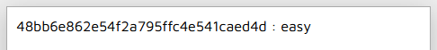
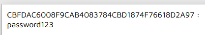
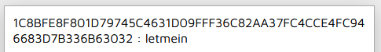

# Crack The Hash
In this challenge, we will have to figure out what hash type is each hash and decrypt it accordingly. We will need to use [rockyou.txt](https://github.com/brannondorsey/naive-hashcat/releases/download/data/rockyou.txt) wordlist and [Hashcat hashes page](https://hashcat.net/wiki/doku.php?id=example_hashes)

We will also use [Hash Analyzer](https://www.tunnelsup.com/hash-analyzer/) and https://md5decrypt.net/en/
## Level 1:
1) 48bb6e862e54f2a795ffc4e541caed4d
This is an MD5 hash.

The answer is: easy

2) CBFDAC6008F9CAB4083784CBD1874F76618D2A97
This is a SHA1 hash.

The answer is: password123

3) 1C8BFE8F801D79745C4631D09FFF36C82AA37FC4CCE4FC946683D7B336B63032
This is a SHA256 hash.

The answer is: letmein

4) $2y$12$Dwt1BZj6pcyc3Dy1FWZ5ieeUznr71EeNkJkUlypTsgbX1H68wsRom
Based on the '$2' at the beginning of the hash, we will refer to the Hashcat site and see that it is bcrypt.

