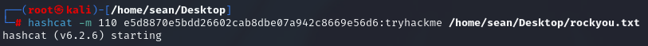

# Crack The Hash
In this challenge, we will have to figure out what hash type is each hash and decrypt it accordingly. We will need to use [rockyou.txt](https://github.com/brannondorsey/naive-hashcat/releases/download/data/rockyou.txt) wordlist and [Hashcat hashes page](https://hashcat.net/wiki/doku.php?id=example_hashes)

We will also use [Hash Analyzer](https://www.tunnelsup.com/hash-analyzer/) and https://md5decrypt.net/en/
## Level 1:
1) 48bb6e862e54f2a795ffc4e541caed4d
This is an MD5 hash.

The answer is: easy

2) CBFDAC6008F9CAB4083784CBD1874F76618D2A97
This is a SHA1 hash.

The answer is: password123

3) 1C8BFE8F801D79745C4631D09FFF36C82AA37FC4CCE4FC946683D7B336B63032
This is a SHA256 hash.

The answer is: letmein

4) $2y$12$Dwt1BZj6pcyc3Dy1FWZ5ieeUznr71EeNkJkUlypTsgbX1H68wsRom
Based on the '$2' at the beginning of the hash, we will refer to the Hashcat site and see that it is bcrypt.
We will use Hashcat for this one. Create a new hash.txt file and place the hash inside of it.
Now run the command 'hashcat -m 3200 [hash.txt path] [rockyou.txt path]'

The answer is: Bleh

5) 279412f945939ba78ce0758d3fd83daa
This is an MD4 hash.

  

## Level 2:
1) 48bb6e862e54f2a795ffc4e541caed4d
This is a SHA256 hash

The answer is: paule

2) 1DFECA0C002AE40B8619ECF94819CC1B
This hash is NTML

The answer is: n63umy8lkf4i

3)Hash: $6$aReallyHardSalt$6WKUTqzq.UQQmrm0p/T7MPpMbGNnzXPMAXi4bJMl9be.cfi3/qxIf.hsGpS41BqMhSrHVXgMpdjS6xeKZAs02.
Salt: aReallyHardSalt
Based on the '$6$' at the beginning of the hash, we will refer to the Hashcat site and see that it is sha512crypt.
We will use Hashcat again. Create a new hash.txt file and place the hash inside of it.
Now run the command 'hashcat -m 1800 [hash.txt path] [rockyou.txt path]'

The answer is: waka99

4) Hash: e5d8870e5bdd26602cab8dbe07a942c8669e56d6
Salt: tryhackme
Based on the hash analyzer, this is a SHA1 hash. Regular hash decrypters won't work on this one, so we will use Hashcat again.

We'll use the command 'hashcat -m 110 e5d8870e5bdd26602cab8dbe07a942c8669e56d6:tryhackme [rockyou.txt path]'.

The answer is: 481616481616
